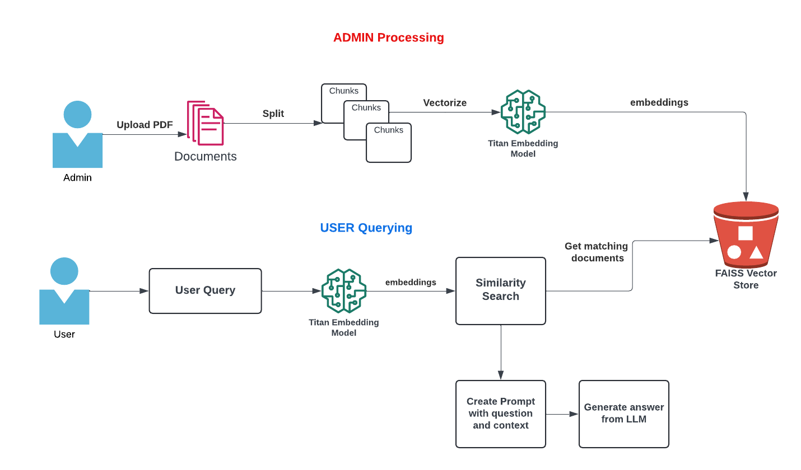
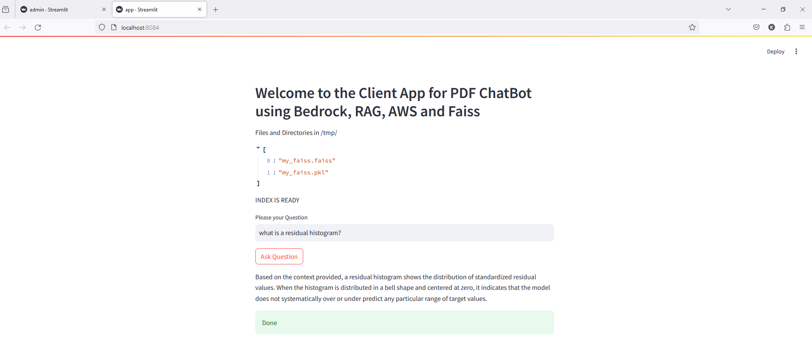

# Detailed Description of Admin Section



## PDF Processing and Vector Store Creation Application

This application processes a PDF file, splits its content into text chunks, creates a FAISS vector store using AWS Bedrock embeddings, and uploads the resulting vector store to AWS S3.

## Overview

The application:

1. Uploads a PDF file via a Streamlit web interface.
2. Splits the PDF content into text chunks.
3. Generates embeddings for the text chunks using AWS Bedrock embeddings.
4. Creates a FAISS vector store from the embeddings.
5. Uploads the FAISS vector store files to an AWS S3 bucket.

## Prerequisites

Ensure you have the following set up:

- AWS credentials configured (`~/.aws/credentials`).
- Docker installed on your machine.
- An S3 bucket to store the vector store files.

## Application Structure

### Python Script

The Python script performs the following tasks:

1. Initializes the S3 client and Bedrock embeddings.
2. Defines helper functions to generate unique IDs, split text into chunks, and create a vector store.
3. Provides the main function that:
   - Displays the Streamlit web interface.
   - Handles PDF file upload.
   - Splits the uploaded PDF into text chunks.
   - Creates a FAISS vector store from the text chunks.
   - Uploads the vector store files to S3.
   - Displays the processing status.

### Dockerfile

The Dockerfile:

1. Sets up the Python environment.
2. Installs required dependencies.
3. Copies the application code into the Docker image.
4. Sets the entry point to run the Streamlit application.

## Running the Application

### Step 1: Configure AWS Credentials

Ensure your AWS credentials are configured properly:

- On Windows: Store your credentials in `C:\Users\<YourUsername>\.aws\credentials`.
- On Linux/Mac: Store them in `~/.aws/credentials`.

### Step 2: Set Environment Variables

Set the `BUCKET_NAME` environment variable to your S3 bucket name.

### Step 3: Build and Run Docker Container

1. Open your terminal and navigate to the project directory.
2. Build the Docker image using:

   ```sh
   docker build -t pdf-reader-admin002 .
   ```

3. Run the Docker container using:

   ```
   docker run -e BUCKET_NAME=bedrock-llm-chatbot-files -v C:/Users/dumbl/.aws:/root/.aws -p 8083:8083 -it pdf-reader-admin002
   ```

### Step 4: Access the Application

Open your web browser and go to `http://localhost:8083` to access the application.

## Usage

1. Upload a PDF file via the web interface.
2. The application will process the PDF, create a FAISS vector store, and upload the store to your S3 bucket.
3. Check the logs for success or error messages.

## Conclusion

This application provides an end-to-end solution for processing PDF files, creating embeddings, and storing the resulting vector store in AWS S3.

# Detailed Description of User Section

1. **Docker Configuration**:

   - A Dockerfile is provided to set up the Python 3.11 environment, expose port 8084, copy the requirements.txt file, install or upgrade langchain and boto3, copy the application code into the working directory, and set the entry point command to run the Streamlit application.

2. **Python Script Overview**:

   - The script uses various Python libraries and modules to implement a PDF ChatBot application utilizing Bedrock, RAG, AWS, and Faiss.
   - It imports necessary libraries including boto3 for AWS interaction, streamlit for building the web app, and various components from langchain_community for NLP tasks.
   - The script defines functions to set up S3 client, load embeddings, create a unique ID, split text, create a vector store, and get responses to questions.
   - The `main()` function sets up the Streamlit web app interface, allowing users to upload PDF files, ask questions, and receive answers.

3. **S3 Configuration**:

   - The S3 client is configured to interact with an S3 bucket, specified by the `BUCKET_NAME` environment variable.
   - The script includes functions to upload and download files to/from the S3 bucket.

4. **BEDROCK Configuration**:

   - The script initializes the Bedrock client and embeddings, which are used for NLP tasks such as generating responses to questions.

5. **Text Splitting and Vector Store Creation**:

   - The script includes functions to split text into documents (chunks) and create a vector store using FAISS from these documents.

6. **Main Workflow**:

   - In the main function, the Streamlit app interface is set up.
   - Users can upload PDF files, which are then split into text chunks.
   - Users can input questions, and the application provides responses based on the uploaded PDF content.

7. **Execution Flow**:

   - When the script is executed, the main function is called, launching the Streamlit web app.
   - Users interact with the web app, uploading files and asking questions, and the application provides responses accordingly.

8. **Output**:

   - The output is a web-based interface where users can upload PDF files, ask questions, and receive answers based on the content of the uploaded files.

9. **Usage**:
   - The Dockerfile provided can be used to containerize the application for deployment in a Docker environment.
   - Users can build the Docker image using the Dockerfile and run containers based on that image to host the web app.

```
   docker build -t pdf-reader-client1 .

   docker run -e BUCKET_NAME=bedrock-llm-chatbot-files -v C:/Users/dumbl/.aws:/root/.aws -p 8084:8084 -it pdf-reader-client1
```

Usage Instructions:

1.  Set Up AWS Credentials.
2.  Configure Environment Variables.
3.  Build and Run Docker Container.
4.  Access the Application.
5.  Query the Document.



## About Me:

## Connect with me:
